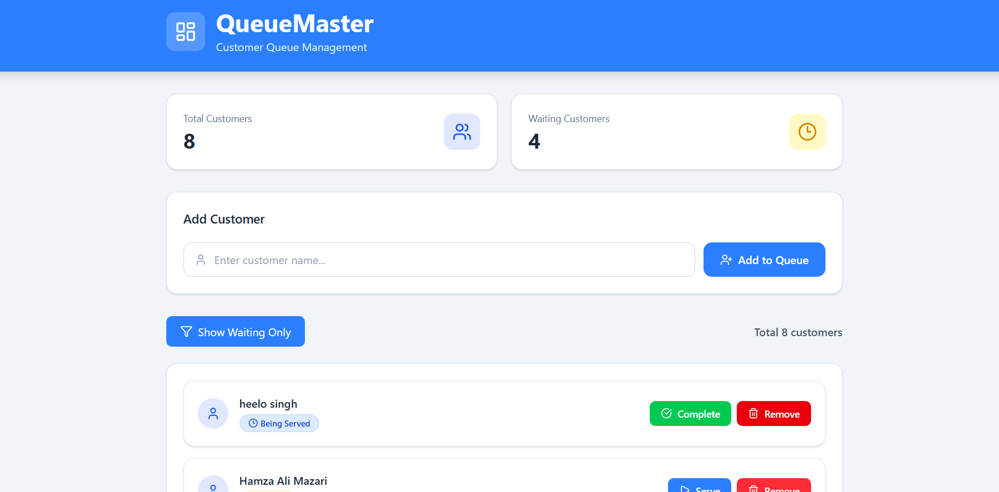

<div align="center">
  <br />
    <h1 align="center">QueueMaster </h1>
     
  <br />

  <div>
    
        
        
    
    
    

  </div>


</div>


## <a name="introduction">✨ Introduction</a>

QueueMaster is a web application designed to help small businesses efficiently manage customer waiting queues. It enables businesses to add customers to a queue, update their service status, and remove completed customers through a simple and intuitive interface.

The application is built using a modern full-stack architecture with **React** for the frontend, **Node.js (Express)** for the backend, and **MongoDB** for data persistence. It is fully containerized using **Docker**, with the frontend and backend running in separate containers to ensure a consistent and portable development environment.

## <a name="tech stack">Tech Stack</a>

| Category | Technology |
|----------|------------|
| **Frontend** | React, Vite, Tailwind CSS, Lucide React |
| **Backend** | Node.js, Express.js |
| **Database** | MongoDB with Mongoose |
| **Containerization** | Docker, Docker Compose |
| **Version Control** | Git & GitHub |

## <a name="project strcture">Project Structure</a>

```text
queueMaster/
│
├── backend/              # Express API
│   ├── controllers/
│   ├── models/
│   ├── routes/
│   ├── services/
│   ├── Dockerfile
│   └── ...
│
├── frontend/             # React + Vite application
│   ├── src/
│   │   ├── components/
│   │   ├── services/
│   │   └── ...
│   ├── Dockerfile
│   └── ...
│
├── docker-compose.yml
└── README.md
```

## <a name="assumptions">Assumptions</a>

- **Duplicate customer names:** Allowed. Each customer has a unique MongoDB `_id`, so names do not need to be unique.
- **Queue order:** Waiting customers are displayed in the order they were added (FIFO). However, the business owner can serve or remove any customer at any time.
- **Completed customers:** Customers marked as **completed** remain in the database but are hidden when viewing only waiting customers. They can still be removed.
- **Returning to the queue:** A completed customer cannot be moved back to the waiting queue. They must be added again as a new customer.
- **Empty queue:** If there are no customers to display, the application shows a **"No customers in queue."** message.
- **Status flow:** Customers move through the queue in one direction: **Waiting → Being Served → Completed**.
- **Customer view:** By default, all customers are displayed. Users can switch to view only customers with the **waiting** status.


## <a name="Prerequisites">Prerequisites</a>

Before running the project, make sure you have the following installed:

### For Local Development

- Node.js (v16 or later)
- npm (v7 or later)
- MongoDB (Local installation or MongoDB Atlas)

### For Docker Setup

- Docker Desktop (or Docker Engine v20+)
- Docker Compose (v2+)

## <a name="Docker">Running the Application with Docker</a>

### 1.  Clone the Repository

```bash
git clone https://github.com/Amit-yadav099/QueueMaster.git
cd QueueMaster
```


### 2. Configure Environment Variables


### Backend

Create the .env file in the backend folder and copy the information provided in backend/.env.exmaple


Update the `backend/.env` file with your MongoDB connection string.

Example:

```env
PORT=5000
MONGO_URI=your_mongodb_connection_string
```

> **Note:** You can use either a local MongoDB instance or a MongoDB Atlas connection string.

### Frontend

Create the .env file in the frontend folder and copy the backend URL present in the `frontend/.env.example`


```
VITE_API_URL=http://localhost:5000/api
```

---

## 3. Build the Docker Images

From the project root, run:

```bash
docker compose build
```
> **Note:** Make sure your docker engine is running.
---

### Start the Containers

```bash
docker compose up
```

To run the containers in the background:

```bash
docker compose up -d
```

---

## 4. Access the Application

Once both containers are running:

| Service | URL |
|----------|-----|
| Frontend | http://localhost:3000 |
| Backend API | http://localhost:5000/api |

---

## 5. Stop the Application

If the containers are running in the foreground:

Press:
```
Ctrl + C
```

If running in detached mode:
```bash
docker compose down
```

---

## 6. Verify the Containers

To check that both containers are running:

```bash
docker ps
```

You should see two running containers:

- queue-frontend
- queue-backend

---

## Rebuild After Code Changes

If you modify the Dockerfile or install new dependencies, rebuild the images:

```bash
docker compose build
docker compose up
```

## <a name="withoutDocker">Run the application without Docker</a>

After setup the .env file in the frontend and backend (similar to as of mentioned in docker approach)

## frontend 
Open a new terminal and navigate to the `frontend` directory:

```bash
cd frontend
npm install
npm run dev
```
The frontend will be available at:
```
http://localhost:3000
```

## backend
Open a new terminal and navigate to the `backend` directory:

```bash
cd backend
npm install
npm run dev
```
The backend will be available at:
```
http://localhost:5000
```

---

## <a name="API_endPOint">API EndPoints</a>

| Method | Endpoint | Description |
|--------|----------|-------------|
| **GET** | `/api/customers` | Retrieve all customers. Supports an optional `?status=waiting` query parameter to filter waiting customers. |
| **POST** | `/api/customers` | Add a new customer to the queue. |
| **PATCH** | `/api/customers/:id/status` | Update a customer's status (`waiting`, `being-served`, or `completed`). |
| **DELETE** | `/api/customers/:id` | Remove a customer from the queue. |
| **GET** | `/api/health` | Check whether the backend service is running. |


## <a name="More_Time">If I Had More Time</a>


Given additional development time, I would focus on improving scalability, reliability, and the overall user experience.

### Planned Improvements

- **Pagination / Infinite Scrolling** – Load customers in smaller batches to improve performance with large queues.
- **Completed Queue History** – Add a dedicated page to view previously completed customers along with timestamps.
- **Real-time Updates** – Integrate Socket.io to synchronize queue updates across multiple devices instantly.
- **Authentication & Authorization** – Restrict queue management to authenticated business owners.
- **Enhanced UI/UX** – Improve responsiveness and accessibility using a component library such as Material UI or Ant Design.
- **Input Validation** – Add comprehensive request validation using Joi or Express Validator.
- **Logging & Monitoring** – Integrate request logging and centralized error tracking using Morgan and Winston.
- **Testing** – Add unit and integration tests for both frontend and backend.
- **Database Optimization** – Create indexes on frequently queried fields such as `status` and `createdAt`.
- **Docker Improvements** – Use multi-stage Docker builds, health checks, and production-ready container optimizations.


## <a name="Compromises">Compromises Made Due to the 1-Hour Time Limit</a>

To prioritize the core functionality, a few non-essential features were intentionally left out:

- Authentication and authorization were not implemented.
- The UI focuses on simplicity rather than advanced responsive design.
- Real-time synchronization between multiple users was not included.
- Pagination was omitted since the expected queue size is relatively small.
- Error handling is basic and could be improved with better validation and user-friendly messages.
- Automated testing was not implemented.
- No database seeding was added; the queue starts empty and customers must be added manually.

## <a name="Submission">Submission</a>

This project was developed as part of a Software Engineering pre-internship assignment.

The repository includes:

- Complete source code
- Docker configuration
- Environment variable examples
- Project documentation
- Setup instructions for both Docker and local development

Thank you for taking the time to review this project. Feedback is always appreciated.
